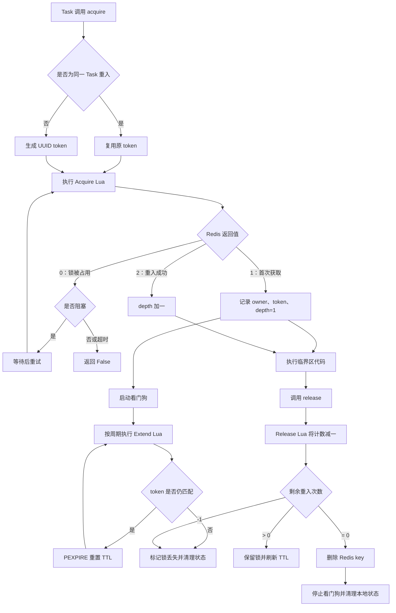

# Async Reentrant Redis Lock with Watchdog

一个基于 `redis.asyncio`、Lua 脚本和 `asyncio.Task` 所有权实现的异步 Redis 可重入分布式锁。

该实现没有继承 `redis.asyncio.lock.Lock`，而是独立管理以下状态：

- 使用 `asyncio.current_task()` 判断是否为同一个协程任务重入；
- 使用随机 UUID token 标识 Redis 中的锁持有者；
- 使用 Redis Hash 保存 token 和重入次数；
- 使用 Lua 脚本保证获取、释放和续期操作的原子性；
- 使用后台看门狗定期重置锁的 TTL；
- 在锁过期、token 不匹配或续期失败时标记锁已丢失。

## 特性

- 支持 `asyncio`；
- 支持同一 Task 内嵌套重入；
- 不同 Task、进程或机器之间保持互斥；
- 支持阻塞、非阻塞和限时等待；
- 支持自动续期和手动续期；
- 支持 `async with`；
- 支持查询锁状态、所有权和丢锁状态；
- Redis 关键操作由 Lua 脚本原子执行。

## 运行环境

- Python 3.10+；
- Redis Server；
- 支持 asyncio 的 `redis-py`。

安装依赖：

```bash
pip install redis
```

运行测试时还需要：

```bash
pip install pytest pytest-asyncio
```

## 实现机制

### 1. Task 级所有权

锁在本地保存三个核心字段：

```python
self._owner_task  # 当前持有锁的 asyncio Task
self._token       # Redis 中的持有者标识
self._depth       # 本地重入层数
```

只有同时满足以下条件，获取操作才会被判断为重入：

1. 使用同一个 `ReentrantRedisLock` 实例；
2. 调用者是同一个 `asyncio.Task`；
3. 本地保存了有效 token；
4. 本地重入深度大于 0；
5. Redis 中仍然存在相同 token。

其他 Task 即使运行在同一线程，也会生成新的 token，并按照普通竞争者处理。

### 2. Redis 数据结构

锁使用 Redis Hash 保存持有者 token 和重入次数：

```text
Key:   lock_name
Field: random_token
Value: reentrant_count
TTL:   timeout milliseconds
```

首次获取后的数据近似为：

```text
HSET lock_name random_token 1
PEXPIRE lock_name timeout_ms
```

同一 Task 再次获取时，对重入次数执行：

```text
HINCRBY lock_name random_token 1
```

### 3. Lua 原子操作

实现包含三段 Lua 脚本：

| 脚本 | 功能 | 主要返回值 |
| --- | --- | --- |
| Acquire | 首次获取或增加重入次数 | `0` 失败、`1` 首次获取、`2` 重入 |
| Release | 减少重入次数或删除锁 | `-1` 已丢锁、`0` 完全释放、`>0` 剩余次数 |
| Extend | token 匹配时重置 TTL | `0` 失败、`1` 成功 |

Lua 脚本使“检查 token、修改计数、设置 TTL”等步骤在 Redis 中作为一个原子操作执行。

### 4. 看门狗续期

首次获取锁成功后，锁会创建一个后台看门狗 Task。看门狗持有获取时的 token，并按照 `renew_interval` 定期调用续期脚本：

```text
token 匹配  -> PEXPIRE 重置 TTL
token 不匹配 -> 标记锁丢失并清理本地状态
Redis 异常  -> 在租约有效期内缩短间隔重试
```

最终释放锁时，看门狗会被取消并等待退出，避免后台续期任务泄漏。

## 工作流程



## 基本使用

```python
import asyncio
from redis.asyncio import Redis

from mylock import ReentrantRedisLock


async def main():
    redis_client = Redis(
        host="127.0.0.1",
        port=6379,
        decode_responses=True,
    )

    lock = ReentrantRedisLock(
        redis_client,
        name="rlock:v1:order:1001",
        timeout=10.0,
        renew_interval=3.0,
    )

    try:
        async with lock:
            print("lock acquired")
            await asyncio.sleep(1)
    finally:
        await redis_client.aclose()


asyncio.run(main())
```

## 同一 Task 内重入

```python
async with lock:
    print(lock._depth)  # 1

    async with lock:
        print(lock._depth)  # 2

        async with lock:
            print(lock._depth)  # 3

    print(lock._depth)  # 1

# 完全退出后 Redis key 被删除，depth 恢复为 0
```

可重入范围是“同一个锁实例中的同一个 Task”。两个独立创建的锁实例即使使用相同 name，也会被视为两个竞争者：

```python
lock1 = ReentrantRedisLock(redis_client, "shared-lock")
lock2 = ReentrantRedisLock(redis_client, "shared-lock")

await lock1.acquire()

# lock2 使用不同 token，因此不能把 lock1 视为自己的重入
acquired = await lock2.acquire(blocking=False)
assert acquired is False

await lock1.release()
```

## 阻塞与超时

非阻塞获取：

```python
acquired = await lock.acquire(blocking=False)

if not acquired:
    print("lock is already held")
```

限时阻塞获取：

```python
acquired = await lock.acquire(
    blocking=True,
    blocking_timeout=0.5,
)
```

`blocking_timeout` 表示最大等待时间。为了避免下一次轮询超过截止时间，实际返回时间可能比该值略短，误差上限通常接近一次 `sleep` 间隔。

## 手动续期

通常看门狗会自动续期，也可以由持有锁的 Task 手动调用：

```python
async with lock:
    await lock.renew()
```

其他 Task 调用 `renew()` 会抛出 `LockError`。

## 状态查询

```python
await lock.locked()  # Redis 中是否存在该锁
await lock.owned()   # 当前 Task 是否拥有该锁
lock.lost            # 本地是否确认锁已丢失
await lock.wait_until_lost()  # 等待看门狗确认丢锁
```

`locked()` 只表示 Redis 中存在对应 key，不表示当前 Task 是持有者。需要判断当前 Task 的所有权时，应使用 `owned()`。

## 构造参数

| 参数 | 默认值 | 说明 |
| --- | --- | --- |
| `redis` | 无 | `redis.asyncio.Redis` 客户端 |
| `name` | 无 | Redis 锁名称，建议使用独立命名空间 |
| `timeout` | `10.0` | Redis 锁租约时间，单位为秒 |
| `blocking` | `True` | 获取失败时是否循环等待 |
| `blocking_timeout` | `None` | 最长阻塞时间；`None` 表示不限制 |
| `sleep` | `0.1` | 两次获取尝试之间的等待时间 |
| `auto_renew` | `True` | 是否启用看门狗 |
| `renew_interval` | `timeout / 3` | 看门狗续期间隔 |
| `raise_on_release_error` | `True` | 上下文退出时释放失败是否抛出异常 |

要求：

- `timeout > 0`；
- `sleep > 0`；
- `blocking_timeout` 不能为负数；
- `0 < renew_interval < timeout`。

## 异常

| 异常 | 场景 |
| --- | --- |
| `LockError` | 非持有者 Task 释放或续期、上下文获取失败 |
| `LockNotOwnedError` | Redis 锁已过期、token 已变化或当前客户端已经失去所有权 |
| `ValueError` | 构造参数不合法 |

## 运行测试

```bash
pytest -q
```

建议至少覆盖以下场景：

1. 基本获取和释放；
2. 同一 Task 多层重入；
3. 不同 Task 竞争同一个锁实例；
4. 不同锁实例竞争相同 Redis key；
5. 非阻塞获取失败；
6. 阻塞等待超时；
7. 看门狗使锁存活超过原始 TTL；
8. 非持有者 Task 非法释放；
9. Redis key 被删除或 token 被替换后的丢锁处理；
10. Redis 暂时不可用时的续期重试。

## 使用边界

### 重入范围

重入只对“同一个 `ReentrantRedisLock` 实例、同一个 `asyncio.Task`”成立。不要在持锁期间重新创建另一个同名实例并期望它能够重入。

一个锁实例应只在创建它的事件循环中使用，不建议跨线程或跨事件循环共享。

### Redis key 类型

该实现使用 Redis Hash。不要让业务代码或其他锁实现使用同名 String、List 等数据类型，否则可能产生 `WRONGTYPE`。

建议使用带版本的独立前缀：

```text
rlock:v1:<resource-type>:<resource-id>
```

### 一致性限制

看门狗可以降低业务执行时间超过 TTL 导致锁提前过期的概率，但不能消除以下情况：

- 客户端进程长时间暂停；
- Redis 网络分区；
- Redis 主从切换时锁数据尚未完成复制；
- 锁已经过期，但原业务仍然继续执行；
- 续期请求结果不确定。

对于订单、库存、余额等强一致性业务，不应将 Redis 锁作为唯一正确性保障。应同时使用数据库唯一约束、条件更新、事务、CAS 或 fencing token。

### 凭据安全

不要在源代码、测试文件或 README 中提交 Redis 密码。使用环境变量、密钥管理服务或本地 `.env` 文件，并将 `.env` 加入 `.gitignore`。

## 项目结构建议

```text
.
├── mylock.py
├── test_mylock.py
├── README.md
├── requirements.txt
└── LICENSE
```

## License

发布前请根据项目需求添加合适的开源许可证，例如 MIT、Apache-2.0 或 BSD-3-Clause。
